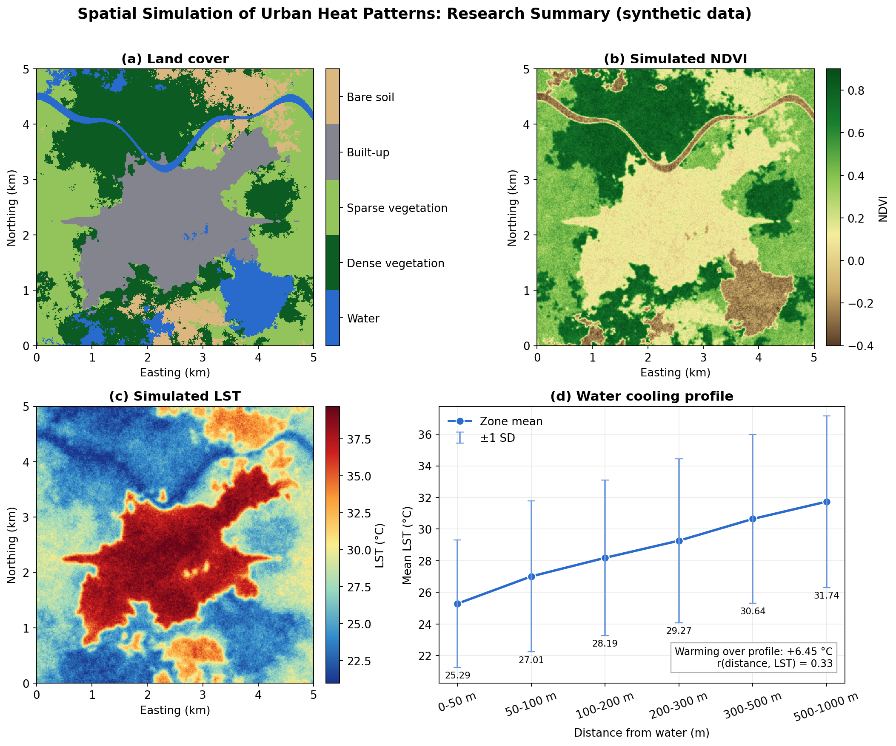

## Spatial Simulation of Urban Heat Patterns Using Land Cover, Vegetation, and Built-Up Effects


A small, fully reproducible **MATLAB-only** research-style project that simulates how vegetation,
water bodies and built-up surfaces shape Land Surface Temperature (LST) in a mixed urban landscape.
The workflow mirrors a Remote Sensing / GeoAI analysis (land cover → spectral indices → LST →
spatial and statistical analysis), but **every input is generated synthetically**.



> **Important:** this is a *synthetic simulation*. Nothing here is satellite-derived LST, and the
> numbers must not be interpreted as measurements of any real city.

---

## Overview

A 500 × 500 cell grid (10 m cells, 5 km × 5 km) is populated with five land-cover classes arranged in
realistic, spatially coherent patterns: a meandering river and an irregular lake, an urban core with
sub-centres and ribbon corridors, clustered vegetation and patchy bare soil. Synthetic NDVI, NDBI and
NDWI are derived from the landscape, and LST is built from an explicit, additive physical model rather
than assigned from the class label. The project then quantifies land-cover temperature contrasts,
water and vegetation cooling gradients, correlations, and a multiple regression.

## Research Question

*How do vegetation cover, water bodies and built-up surfaces jointly control the spatial pattern of
land surface temperature, and how well do simple spectral indices (NDVI, NDBI, NDWI) recover that
pattern?*

## Objectives

1. Generate a realistic synthetic urban landscape without external data.
2. Simulate NDVI, NDBI, NDWI and a physically motivated LST field.
3. Quantify the cooling influence of water bodies and dense vegetation as a function of distance.
4. Estimate correlations and a multiple linear regression `LST ~ NDVI + NDBI + NDWI`.
5. Export publication-style figures, a MAT file and a CSV of summary statistics.

## Methodology

```
Synthetic Landscape
       ↓
Land Cover Simulation
       ↓
NDVI / NDBI / NDWI
       ↓
LST Simulation
       ↓
Spatial Cooling Analysis
       ↓
Statistical Analysis
       ↓
Visualization & Results
```

See [`docs/methodology.md`](docs/methodology.md) for the full description and equations.

## Simulation Framework

| Step | Function | What it does |
|------|----------|--------------|
| 1 | `generate_landscape.m` | Urban intensity field (Gaussian cores + corridors + noise), river and lake, class assignment |
| 2 | `simulate_lst.m` | Sub-pixel cover fractions, NDVI/NDBI/NDWI, distance transforms, additive LST model |
| 3 | `analyze_spatial_relationships.m` | Descriptive statistics, Pearson correlations, OLS regression, class statistics, distance-zone profiles |
| 4 | `create_figures.m` | 11 PNG figures (300 dpi; summary figure 250 dpi) |
| 5 | `main_simulation.m` | Configuration, orchestration, MAT/CSV export, Command Window summary |
| – | `helper_functions.m` | Noise generator, Gaussian filter, distance transform, percentiles, colormaps |

## Variables

| Variable | Description | Unit |
|----------|-------------|------|
| `landcover` | 1 Water, 2 Dense vegetation, 3 Sparse vegetation, 4 Built-up, 5 Bare soil | class |
| `ndvi` | Normalised Difference Vegetation Index | unitless |
| `ndbi` | Normalised Difference Built-up Index | unitless |
| `ndwi` | Normalised Difference Water Index | unitless |
| `lst` | Simulated land surface temperature | °C |
| `lst_anomaly` | `lst` minus scene mean | °C |
| `dist_water_m`, `dist_dense_veg_m` | Euclidean distance to nearest water / dense-vegetation cell | m |

## Mathematical Model

Sub-pixel fractions `f_k` are Gaussian-blurred class indicators (blur σ = 3 cells for thermal
processes). LST in °C is:

```
LST = T0 + a_b·f_built + a_s·f_soil
         − a_dv·f_dense − a_sv·f_sparse − a_w·f_water
         − c_w·exp(−d_w / L_w)·(1 − f_water)          (water cooling halo)
         − c_v·exp(−d_v / L_v)·(1 − f_dense)          (vegetation cooling halo)
         + UHI + gradient + noise
```

Default parameters (all editable at the top of `src/main_simulation.m`): `T0 = 31`, `a_b = 7`,
`a_s = 4`, `a_dv = 6`, `a_sv = 2.5`, `a_w = 8`, `c_w = 3` with `L_w = 250 m`, `c_v = 1.5` with
`L_v = 150 m`, UHI amplitude 2.5 °C, a regional gradient and spatially correlated noise (SD 0.7 °C).
The spectral indices are generated from the same landscape with **independent** noise, so their
correlation with LST arises only through the shared landscape, as in real imagery.

## Statistical Analysis

- Mean, standard deviation, minimum and maximum of LST; mean NDVI, NDBI, NDWI.
- Pearson correlation of NDVI, NDBI and NDWI with LST (p-values via the incomplete beta function).
- Ordinary least squares `LST ~ NDVI + NDBI + NDWI`: coefficients, standard errors, t-statistics,
  p-values, R², adjusted R² and RMSE (base MATLAB only).
- Mean LST for the distance zones 0–50, 50–100, 100–200, 200–300, 300–500 and 500–1000 m from water
  and from dense vegetation.

## Results

Default run (`rng`-independent deterministic generator, seed 42):

| Metric | Value |
|--------|-------|
| Mean LST / SD | 28.88 °C / 5.43 °C |
| LST range | 19.27 – 41.75 °C |
| Mean NDVI / NDBI / NDWI | 0.360 / −0.110 / −0.247 |
| Pearson r with LST | NDVI −0.462, NDBI +0.935, NDWI +0.003 |
| Regression | LST = 30.63 − 1.69·NDVI + 19.38·NDBI − 4.03·NDWI |
| R² / RMSE | 0.891 / 1.80 °C |

| Land cover | Area (%) | Mean LST (°C) |
|------------|---------:|--------------:|
| Water | 9.8 | 23.39 |
| Dense vegetation | 29.0 | 24.48 |
| Sparse vegetation | 29.0 | 27.61 |
| Built-up | 23.4 | 37.14 |
| Bare soil | 8.7 | 31.73 |

| Distance to water | 0–50 m | 50–100 m | 100–200 m | 200–300 m | 300–500 m | 500–1000 m |
|---|---:|---:|---:|---:|---:|---:|
| Mean LST (°C) | 25.29 | 27.01 | 28.19 | 29.27 | 30.64 | 31.74 |

Interpretation: built-up land is roughly 13–14 °C warmer than dense vegetation and water; LST rises steadily
with distance from water (≈ +6.5 °C from the first to the last zone), and dense vegetation shows a
similar but weaker halo. NDBI is the strongest single predictor. NDWI has almost no *marginal*
correlation with LST because water (high NDWI, cool) and vegetation (very low NDWI, also cool) sit at
opposite ends of NDWI yet are both cool; it becomes significant only after controlling for NDVI and
NDBI in the regression. Distance-zone profiles are partly confounded with land cover (cells far from
water are more often built-up), which mirrors real observational studies. The complete set of numbers
is in `results/summary_statistics.csv`.

## Requirements

- MATLAB R2016b or newer (base MATLAB).
- **No toolboxes required** (no Image Processing, Statistics or Mapping Toolbox).
- No external data, Python, R, GIS software or internet connection.

## Reproducibility

`rng(42)` is set, and additionally all random fields are drawn from a small built-in deterministic
generator (Park–Miller with Box–Muller), implemented in exact double arithmetic. Results therefore do
not depend on the MATLAB version, operating system or the behaviour of `randn`; repeated runs give
identical outputs. All parameters live in the configuration block of `main_simulation.m`.

## Limitations

- Fully synthetic: relationships are imposed by the model, not learned from observations.
- No atmospheric, emissivity, topographic, temporal (diurnal/seasonal) or anthropogenic-heat detail.
- Cooling is modelled as a simple exponential decay; wind, advection and 3D urban form are ignored.
- Index–LST correlations reflect the chosen class-typical index values and noise levels.
- Distance profiles are correlational and partly confounded by land-cover arrangement.

## Future Improvements

- Time series (diurnal/seasonal) LST simulation and day/night contrast.
- Add building height / sky-view factor and wind-driven cooling.
- Spatial regression (geographically weighted regression, spatial lag/error) and Moran's I.
- Machine-learning LST downscaling or random-forest prediction from indices.
- Calibration against real Landsat/Sentinel-derived LST as a companion study.

## Citation

If you use this project, please cite it as described in [`CITATION.cff`](CITATION.cff):

> Ali, M. K. (2026). *Spatial Simulation of Urban Heat Patterns Using Land Cover, Vegetation, and
> Built-Up Effects* (MATLAB) [Computer software].

## License

MIT License, see [`LICENSE`](LICENSE).
